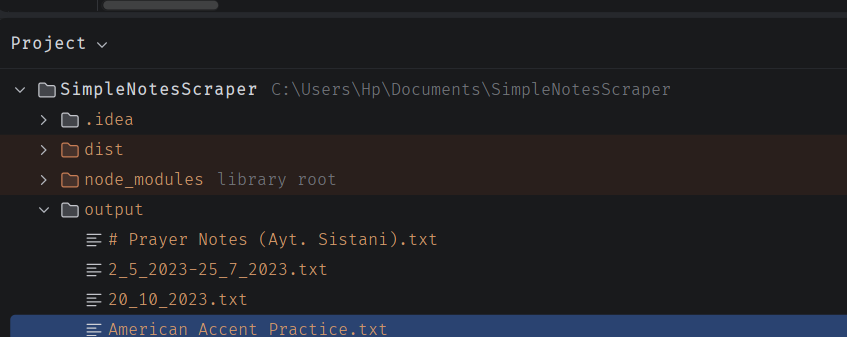

# Simple Notes Scraper

Pulls notes from https://simplenote.com/ and saves them as text files.



## Setup

Install the dependencies:

```bash
npm install
```

Create a `.env` file in the project folder:

```env
TOKEN=your_token_here
GMAIL=your_email_here
```

## Run

```bash
npx tsx src/index.ts
```

The script clears `output/` when it starts, then writes one `.txt` file per note. The filename comes from the note title. Characters that are not valid in Windows filenames are replaced with underscores.

The TypeScript build can be checked with:

```bash
npm run build
```
